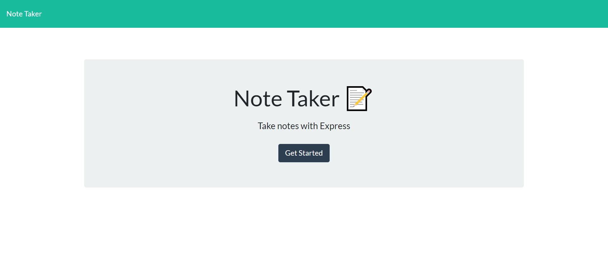
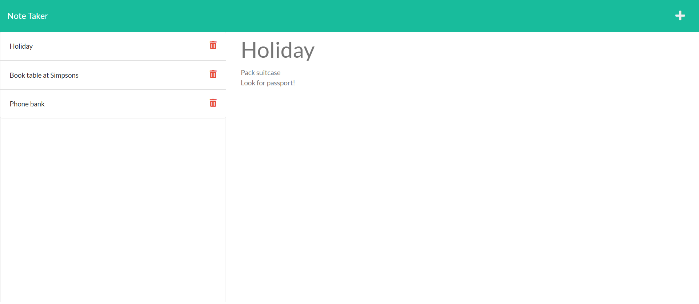
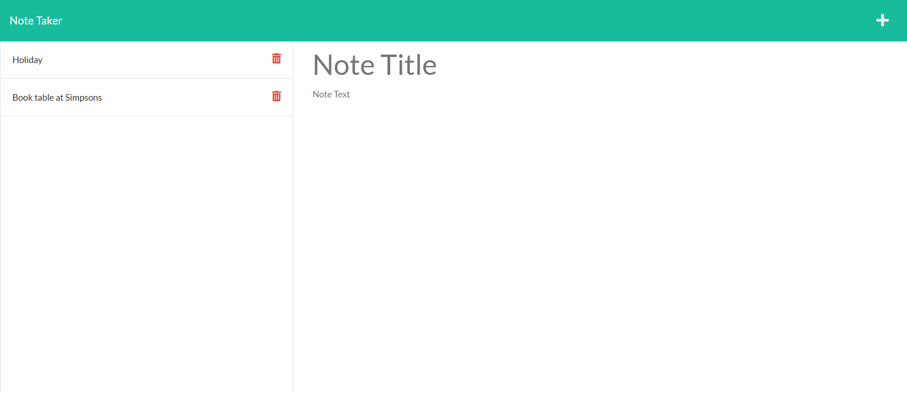
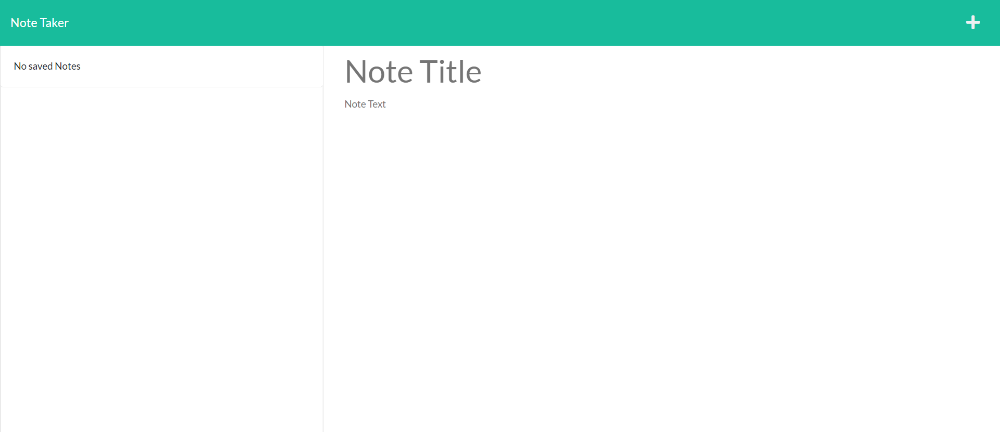

# Note Taker App 

A note-taking app using the Express.js framework

## Table of Contents

- [Project Description](#description)
- [Deployed link](#link)
- [Demo](#demo)
- [Technologies](#technologies)
- [Installation](#installation)
- [Screenshots](#screenshots)
- [License](#license)
- [Tests](#tests)
- [Author](#author)
- [Contact me](#contact)

## Project Description

This application allows a user to write and save notes so that they can organise their thoughts and keep track of what they need to do.

With the front end starter code already in place, this project built a backend to save and retrieve note data. It then connected the backend to the front end.

This application used an Express.js back end to save, delete and retrieve note data from a JSON file, using the `fs` module.

## Deployed link

[Deployed page](https://note-taker-production.up.railway.app/notes)

## Technologies

- Express.js
- Node
- fs
- Nodemon
- Railway
- CSS

## Installation

To generate your own HTML team page, perform the following steps:

Clone the repository, using SSH keys:

`https://github.com/nsharma-uk/note-taker`

Go into the new repository and install the required packages:

`cd note-taker`
`npm install`

You can run the Node CLI application with:

`npm start`

## Screenshots

Landing page:


<br>
All existing notes on the left column with note details of particular note viewed on right columns (in this instance the Holiday note)



<br>
A note has been deleted (Phone bank)


<br>
No added notes - all notes deleted



## License

MIT License

## Tests

Please follow the instructions below:

```
npm run test
```

## User Journey

```
AS A small business owner
I WANT to be able to write and save notes
SO THAT I can organize my thoughts and keep track of tasks I need to complete

GIVEN a note-taking application
WHEN I open the Note Taker
THEN I am presented with a landing page with a link to a notes page
WHEN I click on the link to the notes page
THEN I am presented with a page with existing notes listed in the left-hand column, plus empty fields to enter a new note title and the note’s text in the right-hand column
WHEN I enter a new note title and the note’s text
THEN a Save icon appears in the navigation at the top of the page
WHEN I click on the Save icon
THEN the new note I have entered is saved and appears in the left-hand column with the other existing notes
WHEN I click on an existing note in the list in the left-hand column
THEN that note appears in the right-hand column
WHEN I click on the Write icon in the navigation at the top of the page
THEN I am presented with empty fields to enter a new note title and the note’s text in the right-hand column
```

## Author

N Sharma

## Contact me

Please contact me on my email: [email](nsharmauk711@gmail.com)

Visit my GitHub profile [here](https://github.com/nsharma-uk)
